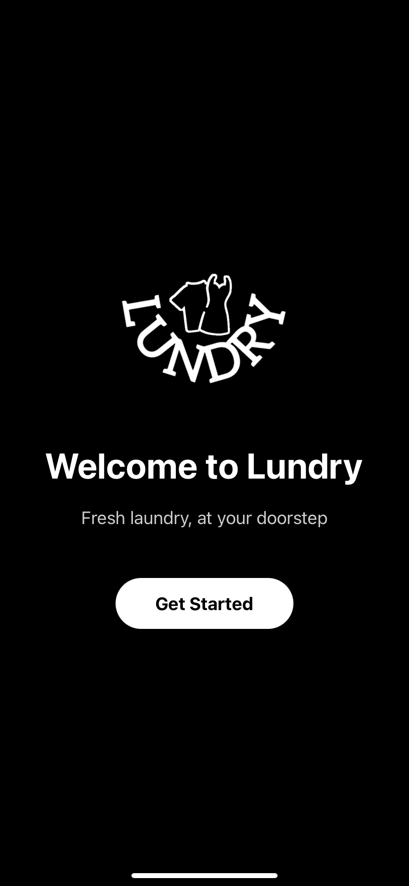
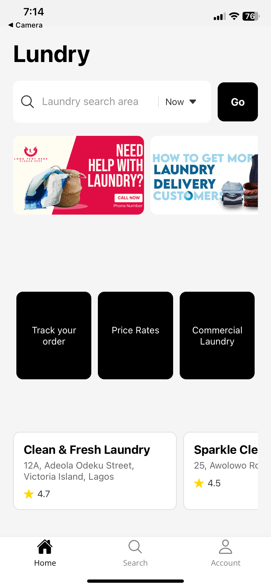

# 🚀 Lundry App

This is a **mobile laundry delivery app** built using **React Native**. The app allows users to schedule pickups, view order history, manage their accounts, and make payments. It provides a seamless way for users to access laundry services from the comfort of their home, streamlining the entire laundry process.

## 📱 Features

- **User Registration & Authentication**: Sign up and log in with personal details.
- **Account Management**: View and edit profile information, including name, email, phone number, and address.
- **Order History**: View past laundry orders with status updates and total amounts.
- **Payment Methods**: Add and manage payment methods securely.
- **Schedule Pickup**: Request laundry service pickup from your location.
- **Push Notifications**: Receive notifications for order status updates.
- **Logout**: Sign out of the account easily.






## 🛠️ Tech Stack

- **React Native**: For building cross-platform mobile applications.
- **React router: For managing routes and navigation in the app.
- **Expo**: For fast and easy development and testing.


## ✨ Getting Started

Follow these instructions to get a copy of the project up and running on your local machine for development and testing purposes.

### Prerequisites

Make sure you have the following installed:
- **Node.js** (v16 or higher)
- **Expo CLI**: Install by running: `npm install -g expo-cli`


### Installation

1. **Clone the repo:**

   ```bash
   git clone https://github.com/yourusername/laundry-app.git
   cd laundryapp
   ```

2. **Install dependencies:**

   ```bash
   npm install
   ```


3. **Start the app:**

   To start the app locally, run:

   ```bash
   npx expo start
   ```

   Use an emulator or the Expo Go app on your phone to scan the QR code and launch the app.

## 🧩 App Structure

Here's a quick look at the directory structure of the project:

```bash
.
├── assets              # App images, icons, and other assets
├── components          # Reusable UI components
├── screens             # Screens for different sections of the app (e.g., Account, Orders, etc.)
├── router              # App router setup
├── services            # API and backend services (e.g., Firebase, MongoDB)
└── App.js              # Main entry point of the app
```

## 🌟 Key Components

- **Account.js**: Handles the user profile, including editing details like name, email, phone number, and payment methods.
- **OrderHistory.js**: Displays past laundry orders with details such as order date, status, and total price.
- **PaymentMethod.js**: Allows users to add, edit, and remove their payment options.
- **LaundrySchedule.js**: Manages the scheduling of laundry pickups from the user’s location.

## 🤝 Contributing

Contributions are what make the open-source community such an amazing place to learn, inspire, and create. Feel free to contribute to the project by submitting a pull request or opening an issue for any bugs or feature suggestions.


**Happy coding!** ✨ Feel free to reach out with any questions or suggestions!

---

### Social Media
- [LinkedIn](https://www.linkedin.com/in/okwudili-onyido-a79411173)
- [Twitter](https://twitter.com/qubesmagazine)

---

